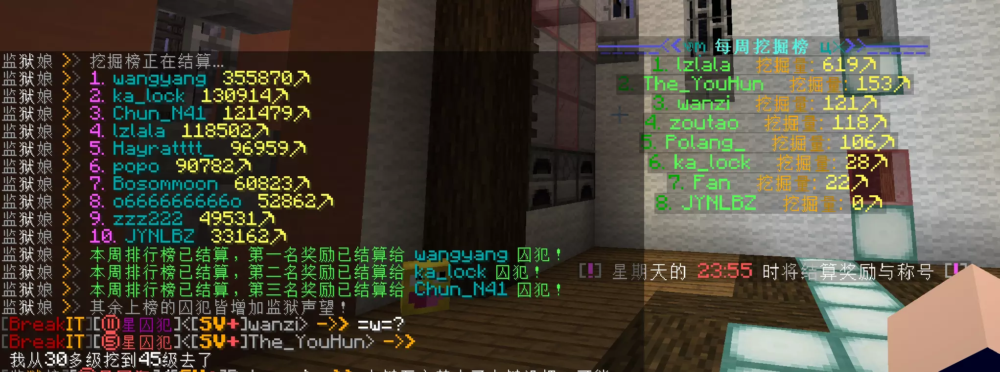
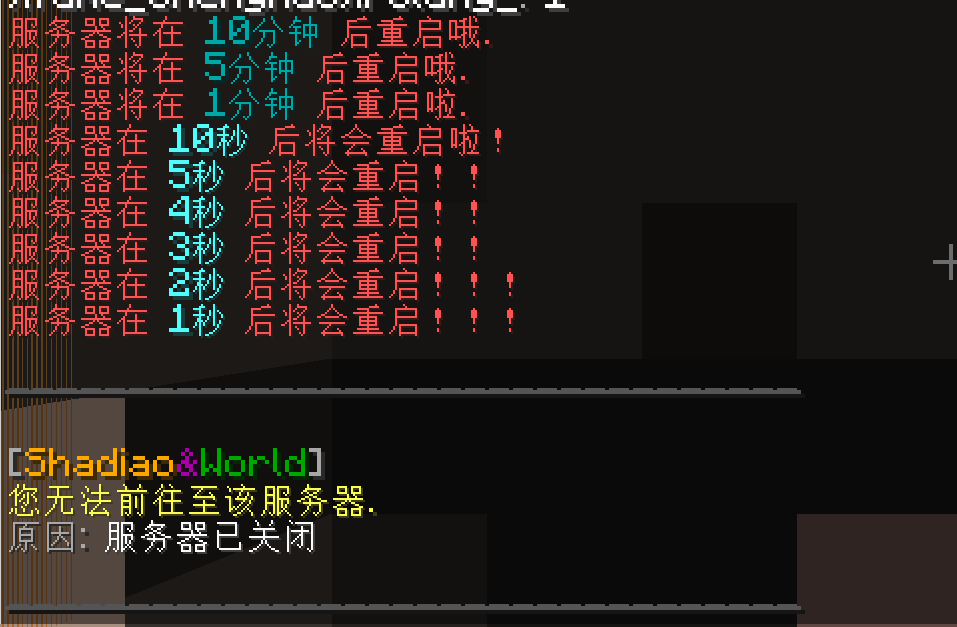

# NoTime

<p align="center">
  
</p>

一个轻量级的 Minecraft 服务器时间管理与防沉迷插件，支持 Folia。


## 功能特性

### ⏰ 防沉迷系统

在指定时间段内限制玩家进入服务器，适合未成年人保护或服务器维护时段管理。

- **白名单/黑名单模式**：灵活控制哪些玩家可以或不能进入
- **自动踢出**：到达限制时间时自动踢出在线玩家
- **反向模式**：可以设置为仅在指定时间内允许进入
- **自定义提示**：可配置被踢出时的提示信息

### 📅 定时任务执行

在特定时间自动执行服务器命令，支持多种时间格式和触发方式。

#### 每周定时任务示例

配合其他插件实现每周排行榜结算与奖励发放：



#### 单时间点任务

每天固定时间执行一次：

```yaml
run:
  "早安问候":
    enable: true
    time: "08:00"
    command:
      - "@m &a早上好！祝您游戏愉快~"
```

#### 多时间点任务

同一天内多个时间点分别执行不同命令：

```yaml
run:
  "整点报时":
    enable: true
    time:
      - "12:00"
      - "18:00"
      - "22:00"
    command:
      - "@m &e现在是中午12点，记得休息一下哦"
      - "@m &e现在是晚上6点，该吃晚饭啦"
      - "@m &e现在是晚上10点，早点休息吧"
```

#### 循环任务

按固定间隔重复执行，支持秒、分、时、天单位：

```yaml
run:
  "自动公告":
    enable: true
    fortime: "10m"  # 每10分钟执行一次
    command:
      - "@m &a服务器交流群：123456789"
      - "@m &d祝您游戏愉快~"
```

### 🎯 智能命令系统

内置丰富的命令前缀，让定时任务更加灵活：

| 前缀      | 说明                   | 示例                                     |
|---------|----------------------|----------------------------------------|
| `@m`    | 向全体玩家广播消息            | `@m &a服务器重启通知`                         |
| `@all`  | 以所有玩家身份执行命令          | `@all give @name@ apple`               |
| `@k`    | 踢出玩家                 | `@k &c您已被踢出`                           |
| `@s`    | 关闭服务器                | `@s`                                   |
| `周=`    | 限定星期几执行              | `周=1;@m 周一福利`                          |
| `月=`    | 限定每月几号执行             | `月=1;@m 月初活动`                          |
| `@papi` | 跳过 PlaceholderAPI 解析 | `@papi @m %server_online%(显示变量原文而非时间)` |

### 🔄 服务器自动重启

完整的倒计时重启方案，从提前通知到最终执行一气呵成：

```yaml
run:
  "自动重启":
    enable: false
    time:
      - "02:50"   # 提前10分钟通知
      - "02:55"   # 提前5分钟
      - "02:59"   # 提前1分钟
      - "02:59:50" # 最后10秒倒计时
      - "02:59:55"
      - "02:59:56"
      - "02:59:57"
      - "02:59:58"
      - "02:59:59"
      - "03:00:00" 
      - "03:00:01" # 执行重启
    command:
      - "@m &c服务器将在 &310分钟 &c后重启"
      - "@m &c服务器将在 &35分钟 &c后重启"
      - "@m &c服务器将在 &31分钟 &c后重启"
      - "@m &c服务器在 &b10秒 &c后重启！"
      - "@m &c服务器在 &b5秒 &c后重启！！"
      - "@m &c服务器在 &b4秒 &c后重启！！"
      - "@m &c服务器在 &b3秒 &c后重启！！"
      - "@m &c服务器在 &b2秒 &c后重启！！！"
      - "@m &c服务器在 &b1秒 &c后重启！！！"
      - "@k &c服务器正在重启"
      - "@s"
```



### 🌍 PlaceholderAPI 支持

无缝集成 PlaceholderAPI，可以在定时任务中使用各种变量占位符，同时可显示任务下一次进行的倒计时

### 🚀 Folia 完全兼容

原生支持 PaperMC 的 Folia 分支，采用异步调度机制，完美适配多线程区域化服务器架构。

### 📊 数据统计


查看完整统计数据：[bStats - NoTime](https://bstats.org/plugin/bukkit/NoTime/19955)

## 安装方法

1. 下载最新版本的 [NoTime.jar](https://github.com/polang233/NoTime/releases)
2. 将 jar 文件放入服务器的 `plugins` 文件夹
3. 启动服务器，插件会自动生成配置文件
4. 编辑 `plugins/NoTime/config.yml` 进行个性化配置
5. 执行 `/notime reload` 重载配置

## 配置说明

详细的配置示例请参考生成的 `config.yml` 文件，里面包含了丰富的使用案例：

- 防沉迷时间段设置
- 单时间/多时间/循环任务配置
- 星期/月份限定任务
- 自动重启完整示例
- 启动命令执行

## 命令与权限

| 命令                   | 权限             | 说明            |
|----------------------|----------------|---------------|
| `/notime`            | `notime.admin` | 主命令（默认 OP 拥有） |
| `/notime reload`     | `notime.admin` | 重载配置文件        |
| `/notime test [任务名]` | `notime.admin` | 测试执行指定任务      |

## 技术特点

- **轻量高效**：基于 `ScheduledThreadPoolExecutor` 实现精准定时调度
- **线程安全**：针对 Folia 优化的异步任务执行机制
- **灵活配置**：YAML 配置文件，修改即时生效
- **易于扩展**：提供 API 接口供其他插件调用

## 常见问题

**Q: 如何只让某些玩家在特定时间不能进入？**  
A: 使用黑名单模式，在 `blacklist` 中添加玩家名字即可。

**Q: 定时任务没有执行怎么办？**  
A: 检查任务的 `enable` 是否为 `true`，并确认时间格式正确（支持 `HH:mm` 和 `HH:mm:ss`）。

**Q: 支持哪些 Minecraft 版本？**  
A: API 版本 1.13+，理论上支持 1.8 以上的所有版本。

**Q: Folia 和普通 Spigot 都能用吗？**  
A: 是的，插件会自动检测运行环境并适配。

## 支持与反馈

- **QQ 交流群**：620224543
- **MineBBS 页面**：[NoTime - MineBBS](https://www.minebbs.com/resources/notime-folia.7885/)
- **苦力怕论坛 页面**：[NoTime - 苦力怕论坛](https://klpbbs.com/thread-160090-1-1.html)
- **问题反馈**：欢迎在交流群或者 [issues](https://github.com/polang233/NoTime/issues) 中提

---

* 觉得好用的话点个 [Star⭐](https://github.com/polang233/NoTime) *